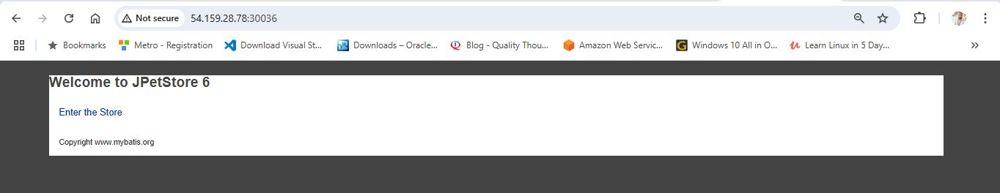
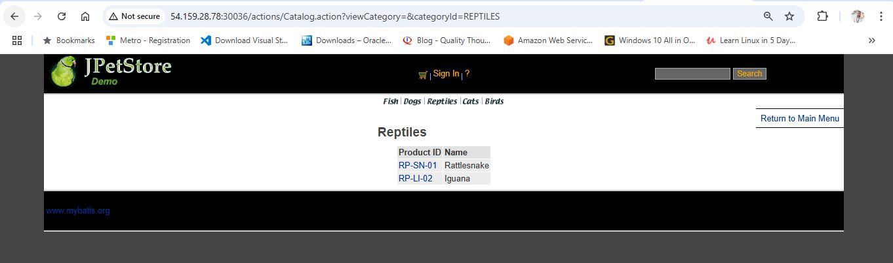
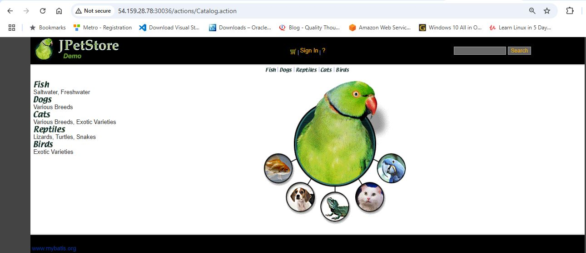
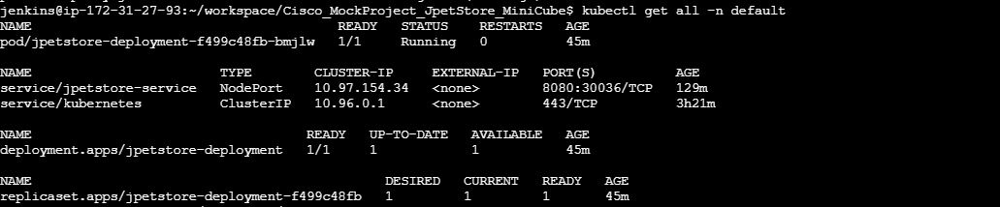

# JPetStore Application Deployment on Minikube (WAR-Based Java App)

This documentation describes how to build, containerize, and deploy a Java WAR application on a local Minikube cluster using Jenkins, including Docker image management via Docker Hub and common troubleshooting steps.

---

## Prerequisites

- Minikube installed and running (`minikube start`)
- Docker installed
- Maven installed
- Jenkins installed and running
- Docker Hub account
- Kubernetes CLI (`kubectl`) installed
- Git repository with:
  - Java project producing `.war` file
  - `Dockerfile`
  - `deployment.yaml` and `service.yaml` Kubernetes manifests

---

## 📦 Installation Steps

### 🔧 Install Docker

```bash
sudo apt-get update
sudo apt-get install -y ca-certificates curl gnupg
sudo install -m 0755 -d /etc/apt/keyrings
curl -fsSL https://download.docker.com/linux/ubuntu/gpg | \
sudo gpg --dearmor -o /etc/apt/keyrings/docker.gpg
echo \
  "deb [arch=$(dpkg --print-architecture) \
  signed-by=/etc/apt/keyrings/docker.gpg] \
  https://download.docker.com/linux/ubuntu \
  $(lsb_release -cs) stable" | \
sudo tee /etc/apt/sources.list.d/docker.list > /dev/null

sudo apt-get update
sudo apt-get install -y docker-ce docker-ce-cli containerd.io
sudo usermod -aG docker $USER
newgrp docker
```
### 🔧 Install kubectl

```bash
curl -LO "https://dl.k8s.io/release/$(curl -s \
https://dl.k8s.io/release/stable.txt)/bin/linux/amd64/kubectl"
chmod +x kubectl
sudo mv kubectl /usr/local/bin/
kubectl version --client
```
### 🔧 Install Minikube

```bash
sudo apt update && sudo apt upgrade -y
sudo apt install -y curl apt-transport-https ca-certificates conntrack
curl -LO https://storage.googleapis.com/minikube/releases/latest/minikube-linux-amd64
sudo install minikube-linux-amd64 /usr/local/bin/minikube
minikube start --driver=docker
```
### verify Minikube installation

```bash
jenkins@ip-172-31-27-93:~/workspace/Cisco_MockProject_JpetStore_MiniCube$ kubectl get all -n kube-system
NAME                                   READY   STATUS    RESTARTS       AGE
pod/coredns-674b8bbfcf-n7q5l           1/1     Running   1 (3h1m ago)   3h21m
pod/etcd-minikube                      1/1     Running   1 (3h1m ago)   3h21m
pod/kube-apiserver-minikube            1/1     Running   1 (138m ago)   3h21m
pod/kube-controller-manager-minikube   1/1     Running   1 (3h1m ago)   3h21m
pod/kube-proxy-jbhhm                   1/1     Running   1 (3h1m ago)   3h21m
pod/kube-scheduler-minikube            1/1     Running   1 (3h1m ago)   3h21m
pod/storage-provisioner                1/1     Running   3 (138m ago)   3h21m

NAME               TYPE        CLUSTER-IP   EXTERNAL-IP   PORT(S)                  AGE
service/kube-dns   ClusterIP   10.96.0.10   <none>        53/UDP,53/TCP,9153/TCP   3h21m

NAME                        DESIRED   CURRENT   READY   UP-TO-DATE   AVAILABLE   NODE SELECTOR            AGE
daemonset.apps/kube-proxy   1         1         1       1            1           kubernetes.io/os=linux   3h21m

NAME                      READY   UP-TO-DATE   AVAILABLE   AGE
deployment.apps/coredns   1/1     1            1           3h21m

NAME                                 DESIRED   CURRENT   READY   AGE
replicaset.apps/coredns-674b8bbfcf   1         1         1       3h21m
jenkins@ip-172-31-27-93:~/workspace/Cisco_MockProject_JpetStore_MiniCube$ 
```

## Directory Structure

```
.
├── k8s-manifests/
│   ├── deployment.yaml
│   └── service.yaml
├── docker-tomcat-deploy/
│   └── maven-wrapper.war
    └── Dockerfile

```

---

## Jenkins Pipeline Overview

```groovy
pipeline {
    agent any

    environment {
        //SONAR_HOST_URL = 'http://3.88.47.160:9000'
        DOCKER_DIR = "docker-tomcat-deploy"
        WAR_NAME = "maven-wrapper.war"
        IMAGE_TAG = "jpetstore"
        IMAGE_NAME = "amanoj3452/hello-world-demo"
        K8S_DIR = "k8s-manifests"
    }

    stages {
        stage('Checkout Code') {
            steps {
                git branch: 'MockProject-demo', 
                    url: 'https://github.com/amanoj553/Cisco_FullStack_MockProject.git'
            }
        }
        stage('Unit Test') {
            steps {
                sh 'mvn test'
            }
        }
        // stage('SonarQube Analysis') {
        //     steps {
        //         withSonarQubeEnv('SonarQube') {
        //             //sh 'sonar-scanner -Dsonar.projectKey=your-key -Dsonar.sources=src -Dsonar.java.binaries=target'
        //             // sh 'sonar-scanner'
        //             sh 'mvn sonar:sonar'
        //         }
        //     }
        // }
        stage('Build WAR') {
            steps {
                sh 'mvn clean package -DskipTests'
            }
        }
        stage('Prepare Docker Build Directory') {
            steps {
                sh '''
                mkdir -p $DOCKER_DIR
                cp target/$WAR_NAME $DOCKER_DIR/$WAR_NAME
                '''
            }
        }
        stage('Build Docker Image') {
            steps {
                sh '''
                cd $DOCKER_DIR
                docker build -t $IMAGE_NAME:$IMAGE_TAG .
                '''
            }
        }
        stage('Push to Docker Hub') {
            steps {
                withCredentials([usernamePassword(credentialsId: 'dockerhub-creds', usernameVariable: 'DOCKER_USER', passwordVariable: 'DOCKER_PASS')]) {
                    sh '''
                    echo "$DOCKER_PASS" | docker login -u "$DOCKER_USER" --password-stdin
                    docker push $IMAGE_NAME:$IMAGE_TAG
                    docker logout
                    '''
                }
            }
        }
        stage('Update K8s Manifest') {
            steps {
                // Substitute image name in deployment.yaml using sed
                sh '''
                sed -i "s|image:.*|image: $IMAGE_NAME:$IMAGE_TAG|" $K8S_DIR/deployment.yaml
                '''
            }
        }
        stage('Deploy to Minikube') {
            steps {
                sh '''
                kubectl apply -f $K8S_DIR/deployment.yaml
                kubectl apply -f $K8S_DIR/service.yaml
                '''
            }
        }
        stage('Access App') {
            steps {
                sh '''
                echo "Waiting for deployment to be available..."
                kubectl rollout status deployment/jpetstore-deployment --timeout=30s
                minikube service jpetstore-service --url
                echo "Forwarding port..."
                nohup kubectl port-forward --address 0.0.0.0 service/jpetstore-service 30036:8080 > jpetstore-portforward.log 2>&1 &
                '''           
            }
        }
        // stage('Pull from Docker Hub & Deploy the War') {
        //     steps {
        //         sh '''
        //         docker rm -f jpetstore-container || true
        //         docker rmi $IMAGE_NAME:$IMAGE_TAG || true
        //         docker pull $IMAGE_NAME:$IMAGE_TAG
        //         docker run -d -p 8086:8080 --name jpetstore-container $IMAGE_NAME:$IMAGE_TAG
        //         '''
        //     }
        // }
        // stage('Deploy WAR') {
        //     steps {
        //         script {
        //             // Define source WAR file path
        //             def warFile = sh(script: "ls target/*.war", returnStdout: true).trim()
                    
        //             // Define Tomcat webapps path (update it as per your Tomcat installation)
        //             def tomcatWebappsPath = "/var/lib/tomcat9/webapps/"
        
        //             // Copy WAR to Tomcat's webapps directory
        //             sh "chmod 755 ${warFile}"  
        //             sh "sudo cp ${warFile} ${tomcatWebappsPath}/"
        
        //             // Optional: Restart Tomcat if auto-deploy is not enabled
        //              sh "sudo systemctl restart tomcat9"
        //         }
        //     }
        // }
    }
}
```

---

## Kubernetes Manifests

### `deployment.yaml`

```yaml
apiVersion: apps/v1
kind: Deployment
metadata:
  name: jpetstore-deployment
spec:
  replicas: 1
  selector:
    matchLabels:
      app: JpetStore
  template:
    metadata:
      labels:
        app: JpetStore
    spec:
      containers:
      - name: jpetstore-container
        image: amanoj3452/hello-world-demo:jpetstore
        ports:
        - containerPort: 8080
```

### `service.yaml`

```yaml
apiVersion: v1
kind: Service
metadata:
  name: jpetstore-service
spec:
  type: NodePort
  selector:
    app: JpetStore
  ports:
    - port: 8080
      targetPort: 8080
      nodePort: 30036
```

---

## verify Deployment:

```bash
jenkins@ip-172-31-27-93:~/workspace/Cisco_MockProject_JpetStore_MiniCube$ kubectl get all -n default
NAME                                       READY   STATUS    RESTARTS   AGE
pod/jpetstore-deployment-f499c48fb-bmjlw   1/1     Running   0          45m

NAME                        TYPE        CLUSTER-IP     EXTERNAL-IP   PORT(S)          AGE
service/jpetstore-service   NodePort    10.97.154.34   <none>        8080:30036/TCP   129m
service/kubernetes          ClusterIP   10.96.0.1      <none>        443/TCP          3h21m

NAME                                   READY   UP-TO-DATE   AVAILABLE   AGE
deployment.apps/jpetstore-deployment   1/1     1            1           45m

NAME                                             DESIRED   CURRENT   READY   AGE
replicaset.apps/jpetstore-deployment-f499c48fb   1         1         1       45m
```
## Jenkins Build Logs:

### Jenkins Build and Deployment Log – Successful WAR Deployment to minikube cluster:

[View Log File for Docker Container Deployment](Build_log_Cisco_MockProject_Minikube.txt)
  
### Build Success Screenshots – WAR Deployment to Tomcat










## Accessing the Application

- **Automatically (inside pipeline)**:
  - Port-forwarding via:
    ```bash
    kubectl port-forward --address 0.0.0.0 service/jpetstore-service 30036:8080

    ```
Now visit: http://<Public-IP>:30036 in your browser

- **Manually** (if auto fails):
    ```bash
    kubectl port-forward --address 0.0.0.0 service/jpetstore-service 30036:8080
    ```
- **Open in Browser**:
  ```
  http://<host-ip>:30036
  or
  http://localhost:30036
  ```

---

## Common Troubleshooting

### 1. ❌ `minikube service <svc-name> --url` shows service but inaccessible

**Root Cause**: Pod for the service is not ready.

**Fix**:
- Check pod status:
  ```bash
  kubectl get pods
  ```
- Wait until the pod is in `Running` and `READY 1/1` state.

---

### 2. ❌ `port-forward` works only when run manually

**Root Cause**: Background `nohup` command inside Jenkins may not persist or bind properly due to Jenkins user's environment.

**Fixes**:
- Make sure `--address 0.0.0.0` is used.
- Use port-forward as a `manual post-step` after build in Jenkins.
- Ensure Jenkins user has Kubernetes access (`kubectl config` is set up properly).

---

### 3. ❌ Jenkins user cannot access `kubectl` or Docker

**Fix**:
- Ensure Jenkins user is added to Docker group:
  ```bash
  sudo usermod -aG docker jenkins
  ```
- Make sure Jenkins has access to Kube config:
  - Copy Kube config to Jenkins user:
    ```bash
    sudo cp ~/.kube/config /var/lib/jenkins/.kube/config
    sudo chown jenkins:jenkins /var/lib/jenkins/.kube/config
    ```

---

### 4. ❌ Pipeline fails at `minikube service` with `no running pod for service`

**Fix**:
- Add a wait or check if pod is ready:
  ```bash
  kubectl wait --for=condition=ready pod -l app=JpetStore --timeout=90s
  ```

---

## Notes

- `NodePort` must be exposed and firewall should allow the port.
- Jenkins container (if running inside Docker) must have access to host network or `kubectl` must work inside.

---

## Optional Enhancements

- Replace NodePort with Ingress for real-world deployments.
- Add health checks in the `deployment.yaml`.
- Integrate Slack or email notification on pipeline failure.

---

## Summary

This setup enables you to:

- Build WAR using Maven
- Build Docker image and push to Docker Hub
- Deploy to Minikube using Jenkins
- Automatically access the application via port-forward
- Handle real-world deployment issues during CI/CD
