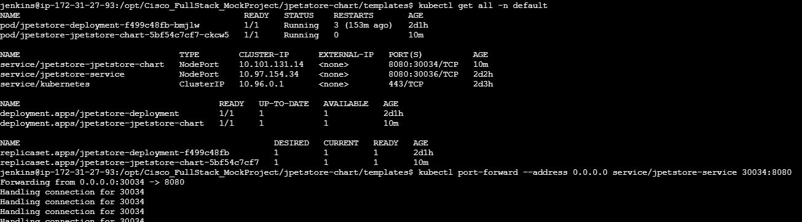
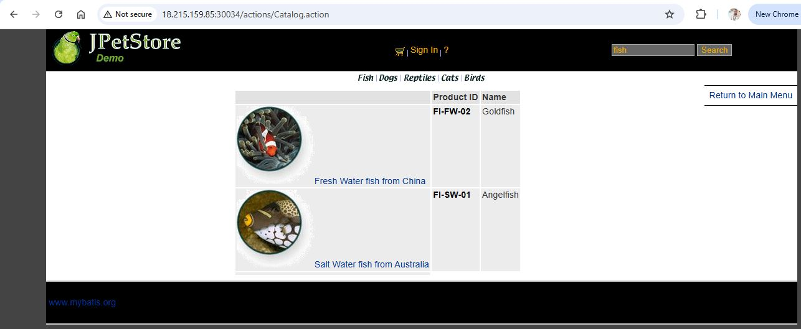
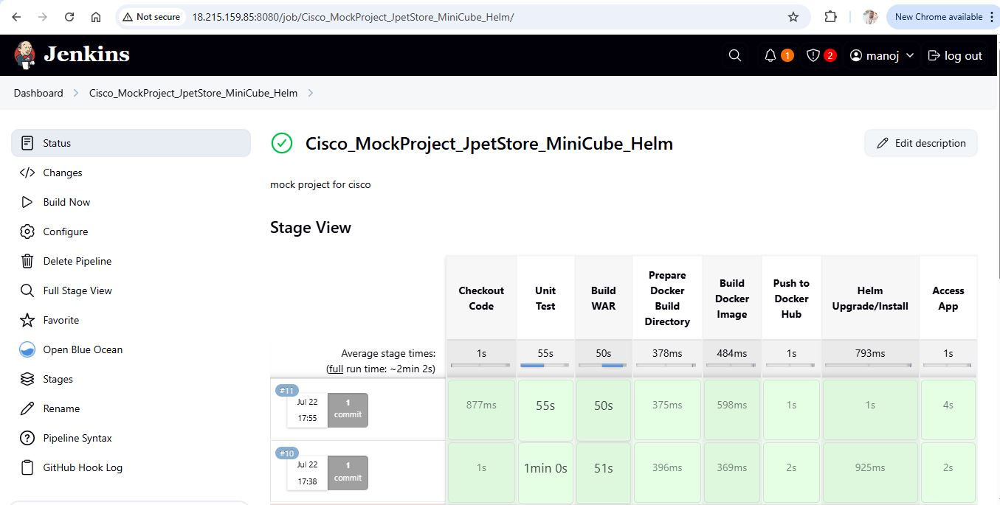

# JPetStore Application Deployment on Minikube using Helm charts (WAR-Based Java App)

This documentation describes how to build, containerize, and deploy a Java WAR application on a local Minikube cluster using helm charts, Jenkins, including Docker image management via Docker Hub and common troubleshooting steps.

---

## Prerequisites

- GitHub repository to store Helm chart and app code
- Minikube cluster up and running
- Helm (v3+) installed and configured
- Jenkins installed with a working pipeline setup
- Docker image available on Docker Hub: `amanoj3452/hello-world-demo`
- Helm chart created at `jpetstore-chart/`
- Jenkins node has access to `kubectl` and `helm`
- Kubernetes context set (`kubectl config use-context`)

---

## Project structure
```bash
├── jpetstore-chart/
│ ├── Chart.yaml
│ ├── templates/
│ │ ├── deployment.yaml
│ │ ├── service.yaml
│ │ └── _helpers.tpl
│ └── values.yaml
├── Dockerfile
└── other source code and resources...
```

## 📦 Installation Steps

### A. In Jenkins Server (Ubuntu 22.04)

#### Install below Packages on Jenkins server

**Install Java:**
```bash
sudo apt update
sudo apt install openjdk-21-jdk maven docker.io git unzip curl -y
```
**Install Jenkins:**
```bash
wget -q -O - https://pkg.jenkins.io/debian-stable/jenkins.io.key | sudo tee /usr/share/keyrings/jenkins-keyring.asc > /dev/null
echo deb [signed-by=/usr/share/keyrings/jenkins-keyring.asc] https://pkg.jenkins.io/debian-stable binary/ | sudo tee /etc/apt/sources.list.d/jenkins.list > /dev/null
sudo apt update
sudo apt install jenkins -y

# start Jenkins service
sudo systemctl start jenkins
sudo systemctl enable jenkins
```
### 🔧 Install Docker

```bash
sudo apt-get update
sudo apt-get install -y ca-certificates curl gnupg
sudo install -m 0755 -d /etc/apt/keyrings
curl -fsSL https://download.docker.com/linux/ubuntu/gpg | \
sudo gpg --dearmor -o /etc/apt/keyrings/docker.gpg
echo \
  "deb [arch=$(dpkg --print-architecture) \
  signed-by=/etc/apt/keyrings/docker.gpg] \
  https://download.docker.com/linux/ubuntu \
  $(lsb_release -cs) stable" | \
sudo tee /etc/apt/sources.list.d/docker.list > /dev/null

sudo apt-get update
sudo apt-get install -y docker-ce docker-ce-cli containerd.io
sudo usermod -aG docker $USER
newgrp docker
```
### 🔧 Install kubectl

```bash
curl -LO "https://dl.k8s.io/release/$(curl -s \
https://dl.k8s.io/release/stable.txt)/bin/linux/amd64/kubectl"
chmod +x kubectl
sudo mv kubectl /usr/local/bin/
kubectl version --client
```
### 🔧 Install Minikube

```bash
sudo apt update && sudo apt upgrade -y
sudo apt install -y curl apt-transport-https ca-certificates conntrack
curl -LO https://storage.googleapis.com/minikube/releases/latest/minikube-linux-amd64
sudo install minikube-linux-amd64 /usr/local/bin/minikube
minikube start --driver=docker
```
### 🔧 Helm Installation On Ubuntu / Debian

```bash
curl https://raw.githubusercontent.com/helm/helm/master/scripts/get-helm-3 | bash
helm version
```
### Helm chart creation
```bash
helm create jpetstore-chart

This creates the basic structure:
jpetstore-chart/
├── charts/
├── templates/
├── values.yaml
├── Chart.yaml

```

### verify Minikube installation

```bash
jenkins@ip-172-31-27-93:~/workspace/Cisco_MockProject_JpetStore_MiniCube$ kubectl get all -n kube-system
NAME                                   READY   STATUS    RESTARTS       AGE
pod/coredns-674b8bbfcf-n7q5l           1/1     Running   1 (3h1m ago)   3h21m
pod/etcd-minikube                      1/1     Running   1 (3h1m ago)   3h21m
pod/kube-apiserver-minikube            1/1     Running   1 (138m ago)   3h21m
pod/kube-controller-manager-minikube   1/1     Running   1 (3h1m ago)   3h21m
pod/kube-proxy-jbhhm                   1/1     Running   1 (3h1m ago)   3h21m
pod/kube-scheduler-minikube            1/1     Running   1 (3h1m ago)   3h21m
pod/storage-provisioner                1/1     Running   3 (138m ago)   3h21m

NAME               TYPE        CLUSTER-IP   EXTERNAL-IP   PORT(S)                  AGE
service/kube-dns   ClusterIP   10.96.0.10   <none>        53/UDP,53/TCP,9153/TCP   3h21m

NAME                        DESIRED   CURRENT   READY   UP-TO-DATE   AVAILABLE   NODE SELECTOR            AGE
daemonset.apps/kube-proxy   1         1         1       1            1           kubernetes.io/os=linux   3h21m

NAME                      READY   UP-TO-DATE   AVAILABLE   AGE
deployment.apps/coredns   1/1     1            1           3h21m

NAME                                 DESIRED   CURRENT   READY   AGE
replicaset.apps/coredns-674b8bbfcf   1         1         1       3h21m
jenkins@ip-172-31-27-93:~/workspace/Cisco_MockProject_JpetStore_MiniCube$ 
```
---

## Jenkins Pipeline Overview

```groovy
pipeline {
    agent any

    environment {
        //SONAR_HOST_URL = 'http://3.88.47.160:9000'
        DOCKER_DIR = "docker-tomcat-deploy"
        WAR_NAME = "maven-wrapper.war"
        IMAGE_TAG = "jpetstore-helm"
        IMAGE_NAME = "amanoj3452/hello-world-demo"
        CHART_DIR = 'jpetstore-chart'
        RELEASE_NAME = 'jpetstore'
        K8S_DIR = "k8s-manifests"
    }

    stages {
        stage('Checkout Code') {
            steps {
                git branch: 'jpetstore-demo-helm', 
                    url: 'https://github.com/amanoj553/Cisco_FullStack_MockProject.git'
            }
        }
        stage('Unit Test') {
            steps {
                sh 'mvn test'
            }
        }
        // stage('SonarQube Analysis') {
        //     steps {
        //         withSonarQubeEnv('SonarQube') {
        //             //sh 'sonar-scanner -Dsonar.projectKey=your-key -Dsonar.sources=src -Dsonar.java.binaries=target'
        //             // sh 'sonar-scanner'
        //             sh 'mvn sonar:sonar'
        //         }
        //     }
        // }
        stage('Build WAR') {
            steps {
                sh 'mvn clean package -DskipTests'
            }
        }
        stage('Prepare Docker Build Directory') {
            steps {
                sh '''
                mkdir -p $DOCKER_DIR
                cp target/$WAR_NAME $DOCKER_DIR/$WAR_NAME
                '''
            }
        }
        stage('Build Docker Image') {
            steps {
                sh '''
                cd $DOCKER_DIR
                docker build -t $IMAGE_NAME:$IMAGE_TAG .
                '''
            }
        }
        stage('Push to Docker Hub') {
            steps {
                withCredentials([usernamePassword(credentialsId: 'dockerhub-creds', usernameVariable: 'DOCKER_USER', passwordVariable: 'DOCKER_PASS')]) {
                    sh '''
                    echo "$DOCKER_PASS" | docker login -u "$DOCKER_USER" --password-stdin
                    docker push $IMAGE_NAME:$IMAGE_TAG
                    docker logout
                    '''
                }
            }
        }
        // stage('Deploy via Helm') {
        //     steps {
        //         script {
        //             // Set Helm release and chart directory
        //             def chartName = "jpetstore"
        //             def chartDir = "./jpetstore-chart" // adjust path if different
        //             sh "helm upgrade --install ${RELEASE_NAME} ${CHART_DIR} \
        //               --set image.repository=amanoj3452/hello-world-demo \
        //               --set image.tag=jpetstore-helm \
        //               --set service.nodePort=30034 --debug"
        //             // sh """
        //             // helm upgrade --install jpetstore ./jpetstore-chart \
        //             //   --set image.repository=amanoj3452/hello-world-demo \
        //             //   --set image.tag=jpetstore-helm \
        //             //   --set service.nodePort=30034
        //             // """
        //         }
        //     }
        // }

        stage('Helm Upgrade/Install') {
          steps {
            sh '''
            helm upgrade --install ${RELEASE_NAME} ${CHART_DIR} \
              --set image.repository=amanoj3452/hello-world-demo \
              --set image.tag=jpetstore-helm \
              --set service.nodePort=30034
            '''
          }
        }

        // stage('Update K8s Manifest') {
        //     steps {
        //         // Substitute image name in deployment.yaml using sed
        //         sh '''
        //         sed -i "s|image:.*|image: $IMAGE_NAME:$IMAGE_TAG|" $K8S_DIR/deployment.yaml
        //         '''
        //     }
        // }
        // stage('Deploy to Minikube') {
        //     steps {
        //         sh '''
        //         kubectl apply -f $K8S_DIR/deployment.yaml
        //         kubectl apply -f $K8S_DIR/service.yaml
        //         '''
        //     }
        // }
        stage('Access App') {
            steps {
                sh '''
                echo "Fetching service URL from Helm deployment..."
                NODE_IP=$(minikube ip)
                NODE_PORT=$(kubectl get svc jpetstore-jpetstore-chart -o=jsonpath="{.spec.ports[0].nodePort}")
                echo "Application should be available at: http://$NODE_IP:$NODE_PORT"
                '''
            }
        }
        // stage('Access App') {
        //     steps {
        //         sh '''
        //         echo "Waiting for deployment to be available..."
        //         kubectl rollout status deployment/jpetstore-deployment --timeout=30s
        //         minikube service jpetstore-service --url
        //         echo "Forwarding port..."
        //         nohup kubectl port-forward --address 0.0.0.0 service/jpetstore-service 30036:8080 > jpetstore-portforward.log 2>&1 &
        //         '''           
        //     }
        // }
        // stage('Pull from Docker Hub & Deploy the War') {
        //     steps {
        //         sh '''
        //         docker rm -f jpetstore-container || true
        //         docker rmi $IMAGE_NAME:$IMAGE_TAG || true
        //         docker pull $IMAGE_NAME:$IMAGE_TAG
        //         docker run -d -p 8086:8080 --name jpetstore-container $IMAGE_NAME:$IMAGE_TAG
        //         '''
        //     }
        // }
        // stage('Deploy WAR') {
        //     steps {
        //         script {
        //             // Define source WAR file path
        //             def warFile = sh(script: "ls target/*.war", returnStdout: true).trim()
                    
        //             // Define Tomcat webapps path (update it as per your Tomcat installation)
        //             def tomcatWebappsPath = "/var/lib/tomcat9/webapps/"
        
        //             // Copy WAR to Tomcat's webapps directory
        //             sh "chmod 755 ${warFile}"  
        //             sh "sudo cp ${warFile} ${tomcatWebappsPath}/"
        
        //             // Optional: Restart Tomcat if auto-deploy is not enabled
        //              sh "sudo systemctl restart tomcat9"
        //         }
        //     }
        // }
    }
}
```

---
## Dockerfile
```bash

# Use official Tomcat image
FROM tomcat:9.0-jdk11

# Remove default apps
RUN rm -rf /usr/local/tomcat/webapps/*

# Copy WAR into container
COPY maven-wrapper.war /usr/local/tomcat/webapps/ROOT.war

# Expose port
EXPOSE 8080

```

## Kubernetes Manifests using Helm charts

### `Values.yaml`

```yaml
# Helm chart values for deploying the jpetstore application

# Set to your private Docker registry credentials if required
imagePullSecrets: []

# Override chart naming (optional)
nameOverride: ""
fullnameOverride: ""

# Service account setup
serviceAccount:
  create: true
  automount: true
  annotations: {}
  name: ""

# Pod annotations and labels
podAnnotations: {}
podLabels: {}

# Pod-level security context
podSecurityContext: {}
#  fsGroup: 2000

# Container-level security context
securityContext: {}
#  runAsUser: 1000
#  runAsNonRoot: true
#  readOnlyRootFilesystem: true
#  capabilities:
#    drop:
#      - ALL

# Ingress setup (optional - currently disabled)
ingress:
  enabled: false
  className: ""
  annotations: {}
  hosts:
    - host: chart-example.local
      paths:
        - path: /
          pathType: ImplementationSpecific
  tls: []
  #  - secretName: chart-example-tls
  #    hosts:
  #      - chart-example.local

# Resource requests and limits (optional)
resources: {}
#  limits:
#    cpu: 100m
#    memory: 128Mi
#  requests:
#    cpu: 100m
#    memory: 128Mi

# HPA configuration (disabled by default)
autoscaling:
  enabled: false
  minReplicas: 1
  maxReplicas: 100
  targetCPUUtilizationPercentage: 80
  # targetMemoryUtilizationPercentage: 80

# Extra volume definitions
volumes: []

# Extra volume mounts
volumeMounts: []

# Node selection and scheduling
nodeSelector: {}
tolerations: []
affinity: []

# Number of pod replicas
replicaCount: 1

# Application-specific environment variables
applicationProperties:
  app: jpetstore

# Container image configuration
image:
  repository: amanoj3452/hello-world-demo
  tag: jpetstore
  pullPolicy: IfNotPresent

# Service configuration
service:
  type: NodePort
  port: 8080
  nodePort: 30034

# Internal container port
containerPort: 8080
```

### `deployment.yaml`

```yaml
apiVersion: apps/v1
kind: Deployment
metadata:
  name: {{ include "jpetstore-chart.fullname" . }}
spec:
  replicas: {{ .Values.replicaCount }}
  selector:
    matchLabels:
      {{- include "jpetstore-chart.selectorLabels" . | nindent 6 }}
  template:
    metadata:
      labels:
        {{- include "jpetstore-chart.labels" . | nindent 8 }}
    spec:
      containers:
        - name: {{ .Chart.Name }}
          image: "{{ .Values.image.repository }}:{{ .Values.image.tag | default .Chart.AppVersion }}"
          imagePullPolicy: {{ .Values.image.pullPolicy }}
          ports:
            - containerPort: {{ .Values.containerPort }}
```

### `service.yaml`

```yaml
apiVersion: v1
kind: Service
metadata:
  name: {{ include "jpetstore-chart.fullname" . }}
spec:
  type: {{ .Values.service.type }}
  ports:
    - port: {{ .Values.service.port }}
      targetPort: {{ .Values.containerPort }}
      {{- if eq .Values.service.type "NodePort" }}
      nodePort: {{ .Values.service.nodePort }}
      {{- end }}
  selector:
    {{- include "jpetstore-chart.selectorLabels" . | nindent 4 }}

```
---

## Jenkins Build Logs:

### Jenkins Build and Deployment Log – Successful WAR Deployment to minikube cluster using Helm charts:

[View Log File for Docker Container Deployment](Build_log_Cisco_MockProject_Minikube_Helm.txt)
  
### Build Success Screenshots – WAR Deployment to Minikube using Helm charts









## Accessing the Application

- **Automatically (inside pipeline)**:
  - Port-forwarding via:
    ```bash
    kubectl port-forward --address 0.0.0.0 service/jpetstore-service 30034:8080

    ```
Now visit: http://<Public-IP>:30036 in your browser

- **Manually** (if auto fails):
    ```bash
    kubectl port-forward --address 0.0.0.0 service/jpetstore-service 30034:8080
    ```
- **Open in Browser**:
  ```
  http://<host-ip>:30034
  or
  http://localhost:30034
  ```

---

## Common Troubleshooting

### 1. ❌ `minikube service <svc-name> --url` shows service but inaccessible

**Root Cause**: Pod for the service is not ready.

**Fix**:
- Check pod status:
  ```bash
  kubectl get pods
  ```
- Wait until the pod is in `Running` and `READY 1/1` state.

---

### 2. ❌ `port-forward` works only when run manually

**Root Cause**: Background `nohup` command inside Jenkins may not persist or bind properly due to Jenkins user's environment.

**Fixes**:
- Make sure `--address 0.0.0.0` is used.
- Use port-forward as a `manual post-step` after build in Jenkins.
- Ensure Jenkins user has Kubernetes access (`kubectl config` is set up properly).

---

### 3. ❌ Jenkins user cannot access `kubectl` or Docker

**Fix**:
- Ensure Jenkins user is added to Docker group:
  ```bash
  sudo usermod -aG docker jenkins
  ```
- Make sure Jenkins has access to Kube config:
  - Copy Kube config to Jenkins user:
    ```bash
    sudo cp ~/.kube/config /var/lib/jenkins/.kube/config
    sudo chown jenkins:jenkins /var/lib/jenkins/.kube/config
    ```

---

### 4. ❌ Pipeline fails at `minikube service` with `no running pod for service`

**Fix**:
- Add a wait or check if pod is ready:
  ```bash
  kubectl wait --for=condition=ready pod -l app=JpetStore --timeout=90s
  ```
### 5. ❌ ServiceAccountName Not Found Error

- If you use this line in your Deployment YAML:
  ```bash
 serviceAccountName: {{ include "jpetstore-chart.serviceAccountName" . }}
  ```
- And you don't define a service account in your chart, it fails.

**Fix**:
- Remove or comment the line above in templates/deployment.yaml.

## 🛠️ Helm Troubleshooting Commands Reference

### 1. ✅ Dry-run & Debug Chart Installation
Check for errors in the chart **before actually installing it**:
```bash
helm install jpetstore-chart . --dry-run --debug
```
- Validates chart syntax, templates, and Kubernetes manifests.

### 2. 📜 Template Rendering to YAML
Render chart templates into Kubernetes manifests (YAML) to debug:
```bash
helm template -f jpetstore-chart/values.yaml . > deployChart.yaml
```
- Helps verify rendered Kubernetes resources without applying.

### 3. 🔍 Helm Lint
Check the chart structure and detect common issues:
```bash
helm lint jpetstore-chart
```
- Detects formatting or structure issues in Helm charts.

### 4. 📦 List Installed Helm Releases
```bash
helm list
```
- Shows all installed Helm releases.

### 5. 🔄 Upgrade with Debug Info
Used to upgrade an existing release with debug output:
```bash
helm upgrade jpetstore-chart . --install --debug
```
- Helpful for diagnosing issues in updates.

### 6.🧼 Cleanup on Failure
Remove the deployed application:
```bash
helm uninstall jpetstore-chart
helm install jpetstore-chart .
```
- Useful when a deployment is broken and needs a reset.

### 7. 🔍 Inspect Values
View currently used values of a release:
```bash
helm get values jpetstore-chart
```

### 8. 🗂️ Inspect All Details of a Release
```bash
helm get all jpetstore-chart
```


## Notes

- Helm charts should reside within the Jenkins workspace (/var/lib/jenkins/workspace/...) during execution.
- Avoid hardcoding minikube IP logic in Jenkins for production. Use LoadBalancer or ingress.
- Always test chart manually (helm install --dry-run --debug) before Jenkins automation.

---

## Optional Enhancements

- Replace NodePort with Ingress for real-world deployments.
- Add health checks in the `deployment.yaml`.
- Integrate Slack or email notification on pipeline failure.

---

## Summary

This setup enables you to:

- Package the Java WAR application using Maven
- Build and tag a Docker image for the WAR application
- Push the Docker image to Docker Hub or a private registry
- Create a Helm chart for Kubernetes deployment of the application
- Deploy the application to Minikube using the Helm chart
- Manage configuration and environment variables using `values.yaml`
- Use Jenkins pipeline for automating Helm deployment as part of CI/CD
- Use Helm's templating, versioning, and upgrade features for controlled releases
- Handle real-world deployment issues using Helm debug and dry-run tools
- Access the application via Minikube NodePort or port-forward
- Monitor and troubleshoot application using Helm and `kubectl` commands

